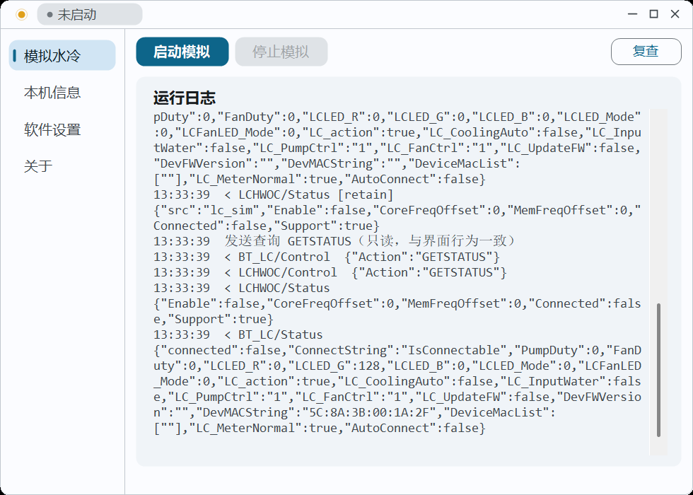

# 虚拟水冷坞 · WaterCoolSim

> 让 **机械革命控制中心（ControlCenterX）** 认为「水冷已连接」的本地模拟器。
> 单文件 exe、零第三方依赖、界面用 Material 3（Monet 动态取色）自绘。



## 它做什么

在同一台机器上运行的本程序，通过本机 MQTT broker（`127.0.0.1:13688`，由控制中心的 `GCUBridge.exe` 提供）发布/保持水冷状态报文，
让控制中心界面显示「水冷已连接」。可用于：没有接水冷坞时演示界面、排查控制中心的水冷相关逻辑、做界面联调。

**它不做什么**：

- 不写驱动、不注入进程、不改控制中心的任何文件或安装目录；
- 不伪造硬件；只与本地 broker 收发 MQTT 报文；
- 停止/关闭时自动把状态**覆盖回「未连接」**，并只清理自己发过的 retained 消息（带 `"src":"lc_sim"` 标记的记录）。

## 原理

控制中心的 UI 进程通过 MQTT 与本机 broker 通信，水冷的判定链路大致是：

| 主题 | 作用 |
|---|---|
| `BT_LC/Status` | 水冷坞状态。含 `connected`（小写键名）、`ConnectString`（`Connected` / `IsConnectable` / `Disconnected`）、`DevFWVersion`、`DeviceMacList` 等 |
| `BT_LC/Control` | 控制指令（`{"Action":"GETSTATUS"}` 等） |
| `LCHWOC/Status` | 水冷超频（HWOC）开关状态：`Enable` / `Connected` / `Support` |
| `LCHWOC/Control` | HWOC 控制指令 |
| `Settings/DeviceSwitchItemStatus` | 设备开关状态（无线/蓝牙/摄像头等） |

本程序按这套报文格式发布（保留位 retained），并在启动/停止时做自检与清理。
broker 对 clientId 有白名单校验，本程序会自动在若干编号间回退尝试。

## 功能

左侧四个页面：

| 页面 | 内容 |
|---|---|
| **模拟水冷** | 启动/停止模拟、6 秒自动复查、运行日志（实时报文） |
| **本机信息** | 系统/硬件（WMI）、GCUBridge 状态、水冷门禁注册表项、.NET 版本、环境自检结果、托盘与自启动状态 |
| **软件设置** | 主机/端口/clientId 编号/重发间隔/MAC/固件版本 + 托盘、开机自启、自启动同时模拟、启动清理、压制真实上报 |
| **关于** | 技术栈、参考的开源项目与许可 |

其它特性：

- 启动时**自动环境自检 + 自动测试连接（只读）**，有问题弹提醒（可选择继续）；
- 关闭窗口可选择「最小化到托盘 / 直接关闭」，可记住选择；托盘图标自己登记（含 `TaskbarCreated` 重登记与 Win11 常显提升）；
- 无边框窗口、圆角边框、自制窗口按钮、非线性动画（OutCubic/OutBack/InOutCubic）；
- 配色用 **Material 3 官方链路**：CAM16 + HCT → TonalPalette → SchemeTonalSpot，主色从桌面壁纸提取（HCT 打分选色）；
- 日志同时落盘到 exe 同级目录的 `WaterCoolSim.log`，便于事后核对。

## 构建

只需要系统自带的 .NET Framework 4.x（`csc.exe`），**不需要 Visual Studio、不需要任何第三方库**：

```bat
build.cmd                 :: 生成 dist\虚拟水冷坞.exe
```

手动编译等价于：

```bat
%SystemRoot%\Microsoft.NET\Framework64\v4.0.30319\csc.exe /nologo /target:winexe /optimize+ \
  /win32manifest:src\app.manifest /win32icon:src\app.ico /out:dist\WaterCoolSim.exe \
  /r:System.Windows.Forms.dll /r:System.Drawing.dll /r:System.Management.dll \
  src\WaterCoolSim.cs src\MonetM3.cs
```

可选：`sign.ps1` 用自签名证书签名（本地信任用；分发给别人请买公共 CA 证书）。

## 命令行

```
虚拟水冷坞.exe                      图形界面
虚拟水冷坞.exe --sim                纯命令行模拟（Ctrl+C 退出并自动清理）
虚拟水冷坞.exe --cleanup            只清理一次（覆盖成「未连接」）
虚拟水冷坞.exe --probe [--seconds N] 只读抓取真实报文
虚拟水冷坞.exe --selfcheck          环境自检 + 只读探测 broker
虚拟水冷坞.exe --palette [--seed 6750A4 | --wallpaper] [--dark]   打印 M3 色板
虚拟水冷坞.exe --runset on|off|status                            设置/查看开机自启动
虚拟水冷坞.exe --shot [--out x.png]  渲染界面截图（含逐页/对话框/失焦）
虚拟水冷坞.exe --guitest            界面自检（不显示窗口）
虚拟水冷坞.exe --autostart          以托盘方式静默启动（自启动项用）
```

## 常见问题

**打开时弹「Windows 已保护你的电脑」（SmartScreen）？**
这不是病毒告警，而是 SmartScreen 对「非公共 CA 签名的新文件」的信誉判定。本仓库的 exe 是本地自签名，所以本地可信、外发必被拦。
自用可关闭「检查应用和文件」（设置 → 隐私和安全性 → Windows 安全中心 → 应用和浏览器控制），或直接点「仍要运行」。
要给别人用，需购买公共 CA 的代码签名证书。

**托盘图标不出现？**
托盘登记需要管理员权限（UIPI 限制），或需要把 exe 加进安全软件（如火绒）信任区。
程序会：先按普通权限尝试登记 → 自检（`Shell_NotifyIconGetRect`）→ 失败自动重建重试 → 仍失败则询问是否以管理员身份重启。
另外 Windows 11 默认把新图标放进“溢出区”（任务栏的 `^`），程序会尝试写 `IsPromoted=1` 把它提升为常显。

**关闭窗口后怎么找回？**
选「最小化到托盘」后，**再双击一次 exe 就会把窗口叫回来**（单实例检测到已有进程时会主动显示它）。

**会影响官方软件吗？**
不会写官方文件；停止/关闭时会把状态覆盖回「未连接」。启动时的清理只针对带 `"src":"lc_sim"` 标记的 retained 消息，
不会动控制中心自己发的状态。

## 目录结构

```
src/                 C# 源码（WaterCoolSim.cs 界面与逻辑、MonetM3.cs 配色、app.ico/manifest）
tools/               逆向与验证用的 Python 脚本（MQTT 客户端、模拟 broker、自检）
docs/                开发笔记（技术笔记.md：完整逆向与实现记录）
docs/screenshots/    界面截图
build.cmd, sign.ps1  构建与（可选）签名脚本
```

## 参考的开源项目

- **Material Design 3**（Google，Apache-2.0）：色角色、组件形态、状态层、形状令牌
- **material-color-utilities**（Google，Apache-2.0）：HCT(CAM16+L\*) / TonalPalette / SchemeTonalSpot 按官方实现
- **easings.net / Robert Penner Easing**（MIT）：OutCubic / InOutCubic / OutBack / OutElastic 曲线
- **MQTT 3.1.1**（OASIS 标准）：客户端为自行实现，未使用 paho/M2Mqtt
- 逆向过程使用 **ILSpy**（MIT）、**innoextract**（zlib）——仅分析用，产物不含其代码

本项目自身是**零第三方运行库**的单文件程序。

## 许可

MIT，见 [LICENSE](LICENSE)。

## 免责声明

仅供本机研究、界面演示与联调使用。控制中心及其组件（GCUBridge 等）的版权归机械革命/其供应商所有，
本仓库只包含自行编写的代码，不含厂商二进制或反编译产物。使用前请自行确认符合你所在地区的法律与厂商条款。
